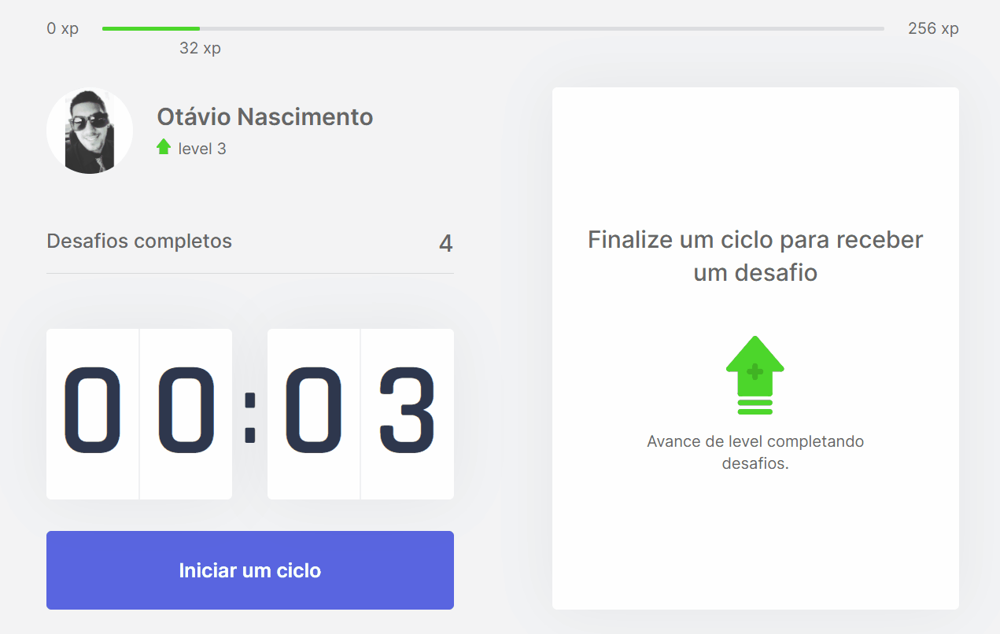

<h1 align="center">
    
</h1>

<h2 align="center"> 
	#NextLevelWeek04 🚀 Moveit
</h2>

<p align="center">
 <a href="#-sobre-o-projeto">Sobre</a> •
  <a href="#-deploy">Deploy</a> •
  <a href="#-instalação">Instalação</a> •
  <a href="#-layout">Layout</a> • 
  <a href="#-resumo-nlw">Resumo NLW</a> • 
  <a href="#-desafios-extras">Desafios Extras</a> 
 </p>

## 💻 Sobre o Projeto
Projeto desenvolvido durante a 4ª edição da NLW. O Moveit, é uma ferramenta que usa a técnica pomodoro para a gestão de tempo que ajuda na produtividade e foco do seu trabalho. O projeto conta também com um sistema de gamificação que, ao completar certos desafios, você subirá de nível.

<p align="center">
  
</p>

---

## 🚀 Deploy
Foram apresentados os serviços Netlify e Vercel, mas, para o deploy dessa aplicação, foi utilizado o serviço [Vercel](https://vercel.com/). O app está online e acessível por [este link](https://nlw04-moveit-one.vercel.app/).

---

## 🔧 Instalação e uso

```bash
# Abra um terminal e copie este repositório com o comando
https://github.com/otavionasc/nlw-04-reactjs-moveit.git

# Entre na pasta do projeto com o comando
cd nlw-04-reactjs-moveit

# Instale as dependências
yarn install

# Rode o aplicação
yarn dev

# Acesse http://localhost:3000 no seu navagador.
```
---

## 🎨 Layout
A UI deste projeto foi criada pelos mentores da NLW utilizando a ferramenta Figma. Para acessar o layout do projeto, basta clicar [neste link](https://www.figma.com/file/n9J6604nMGB7Cgt2vEVtWb/Move.it-1.0-(Dark-Mode)?node-id=154786%3A44).

---

## ✍ Resumo NLW
Nessa edição do NLW, foram abordados os seguintes conceitos, tecnologias e ferramentas para a construção do projeto:
- O projeto foi desenvolvido em [ReactJs](https://reactjs.org/) + [NextJs](https://nextjs.org/) com a IDE [VS Code](https://code.visualstudio.com/);
  - O NextJS foi apresentado como uma solução para melhorar o SEO (Search Engine Optimization) da aplicação web;
- A linguagem escolhida para este projeto foi o [TypeScript](https://www.typescriptlang.org/);
- Para a estilização dos componentes, foi utilizado o [css-modules](https://github.com/css-modules/css-modules). Com este recurso, foi possível estilizar os componentes sem que outros componentes fossem afetados, pois durante o build da aplicação, o css-modules altera a nomenclatura de classes e seletores para que tenham um escopo local;
- Foi utilizado o gerenciador de estado global **Context API**. Com ele foi possível compartilhar parâmetros e funções entre os componentes React;
- Foi adicionada uma notificação personalizada via browser com áudio próprio quando um novo desafio é liberado;
- Foi utilizada a funcionalidade do NextJs, **GetServerSideProps**, recuperar as informações nos cookies do navegador.

---

## 💪 Desafios Extras

- [x]	Documentação no Github
- [ ]	Melhorar a estilização da aplicação com tema dark e versão mobile
- [ ]	o	Inserir perfil do github para capturar informações do usuário. Atualmente o meu perfil está fixo na aplicação